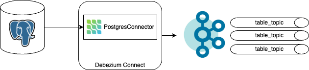
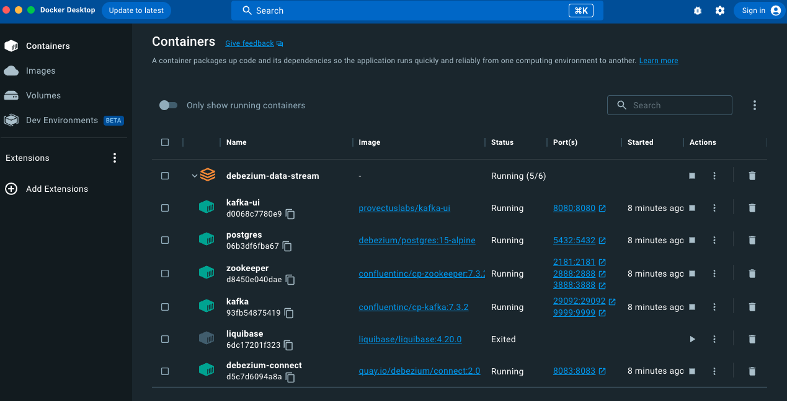

# Debezium Data Stream
This is a POC to capture data changes in a DB and stream it via kafka topics




## Run locally

### Run the docker compose

```bash
docker-compose up -d
````
All services should be up and running as follows




### Create the Debezium Connector   
We will use the connector API exposed in the port 8083.  

**You can use the postman collection in the postman folder or the following curl commands.

First lets check that there is no Connector created

```bash
curl --location 'http://localhost:8083/connectors'
```
This should response an empty array.

Create a new PostgreSQL Connector as follows
```bash
curl --location 'http://localhost:8083/connectors' \
--header 'Content-Type: application/json' \
--data '{
    "name": "playground-connector",
    "config": {
        "connector.class" : "io.debezium.connector.postgresql.PostgresConnector",
        "tasks.max" : "1",
        "topic.prefix" : "pg",
        "database.hostname" : "postgres",
        "database.port" : "5432",
        "database.user" : "hurban",
        "database.password" : "P4ssw0rd",
        "database.dbname": "playground",
        "schema.history.internal.kafka.bootstrap.servers" : "kafka:9092",
        "schema.history.internal.kafka.topic": "schema-changes.playground",
        "database.encrypt": "false"
    }
}'
```
Done! Now all the changes made in the tables will be published in the kafka topics.

### View kafka topics
As part of the docker compose there is a kafka-ui container wich is a GUI for Kafka.
You can see it at `localhost:8080`  

 

## References
https://debezium.io/documentation/reference/stable/connectors/postgresql.html
https://debezium.io/documentation/reference/0.9/tutorial.html#kafka-connect-api
https://github.com/provectus/kafka-ui